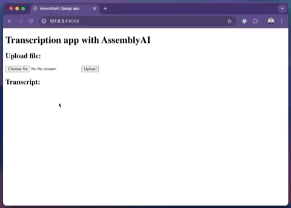

# Django Speech-to-Text app

A simple Django app that allows users to upload and transcribe audio files in a Django app.

Demo:



A **step-by-step tutorial** can be found in the corresponding [blog post](https://www.assemblyai.com/blog/speech-to-text-with-django/).

## Get Started

Step 1: Install dependencies:
```
pip install Django assemblyai python-dotenv
```

Step 2: Rename `/stt_project/.env.template` to `/stt_project/.env` and enter your AssemblyAI API key. You can get a free API key [here](https://www.assemblyai.com/dashboard/signup).

```
ASSEMBLYAI_API_KEY=your_key_here
```

Step 3: Run the server

```
cd stt_project
python manage.py runserver
```

## App architecture

These were the steps to create this demo from scratch. We created one Django project (called `stt_project`)and one Django app (called `transcriptions`):

```
django-admin startproject stt_project
cd stt_project
python manage.py startapp transcriptions
```

The following files were modified:

- The view that handles transcriptions is implemented in `/transcriptions/views.py`
- The template to upload and submit audio files, and to show the transcribed text, is implemented in `/transcriptions/templates/index.html`
- The URLs are defined in `/stt_project/urls.py` and `/transcriptions/urls.py`
- Environment variables are loaded with `load_dotenv()` in `/stt_project/settings.py`

## Improvements

For more advanced implementations with non-blocking options, read this section in the [tutorial blog post](https://www.assemblyai.com/blog/speech-to-text-with-django/#non-blocking-implementations-to-integrate-speech-to-text-in-django).
